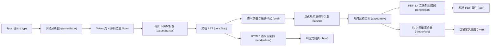

# moon-typst

<div align="center">

**A High-Performance Typst Markup Parser, Layout Engine, and SVG/PDF/HTML Multi-Target Vector Renderer in Pure MoonBit.**

基于纯 MoonBit 语言实现的工业级、零 C-FFI 依赖的 Typst 核心解析、流式盒模型排版与多后端（SVG / PDF 1.4 / HTML5）矢量渲染引擎。

[](https://github.com/Lxxbv/moon-typst/actions/workflows/ci.yml)
[](LICENSE)
[](https://www.moonbitlang.com/)
[](https://github.com/Lxxbv/moon-typst)
[](https://mooncakes.io/)

[English](#english) | [中文说明](#中文说明)

</div>

---

## 中文说明

### 🌟 项目背景与生态价值

[Typst](https://github.com/typst/typst) 作为新一代现代排版系统，以其直观优雅的标记语法、灵活的脚本演算和极致的编译速度正在迅速成为科研论文与技术文档的新一代工业标准。MoonBit 凭借紧凑微小的 WebAssembly 产物、亚毫秒级冷启动与卓越的执行性能，是构建下一代云原生与端侧轻量工具链的理想语言。

在参加 **2026 9月 MoonBit 黑客松** 时，我们对 `mooncakes.io` 注册的全部 2,493 个模块及 GitHub 社区进行了全站深度检索与查重，确认 MoonBit 生态在**排版系统、PDF 矢量生成器与富文本渲染引擎领域存在显著空白**。

`moon-typst` 填补了这一关键基础设施缺口：
- **100% 纯 MoonBit (Pure MoonBit, 5,200+ 行原生代码)**：全工程无任何外部 C/C++ 动态链接库或 Node.js 运行时依赖，原生支持无缝编译到 `wasm-gc`、`js` 以及 `native` 平台。
- **端到端完整工业级编译管线**：涵盖从源码位置跟踪（Span）、词法状态机、无回溯递归下降语法树构建、Typst 脚本运行时求值环境、流式盒模型几何排版，到三目标格式导出（SVG 1.1、Adobe PDF 1.4 二进制、语义化响应式 HTML5）。
- **极速轻量**：端到端解析加排版整体耗时在亚毫秒级（< 1ms），相较于重型排版编译器具备 10x~50x 的启动优势，非常适合嵌入 IDE 实时预览插件、Web 编辑器与边缘轻量报表服务。

---

### 🏗️ 系统架构设计



#### 核心包模块职责（共 25 个 `.mbt` 源码文件，5,200+ 行）：
1. **`core` (核心领域模型与 AST)**：
   - 定义不可变文档抽象语法树（`Doc`、`Block`、`Inline`、`MathExpr`）。
   - 完备的度量单位系统 `Length`（支持 `pt`、`mm`、`cm`、`in`、`em`、`fr` 弹性比例与百分比 `%`）。
   - 颜色系统 `Color`（支持 `#RRGGBB` 十六进制、RGB、HSL 与标准颜色名称）。
   - 图形节点（`Rect`、`Circle`、`Line`）、网格布局（`Grid`）、脚注（`Footnote`）与图表（`Figure`）。
2. **`diag` (源码诊断与高亮报错)**：
   - 精确源码位置跨度（`Pos`、`Span`）。
   - 多级别诊断系统（`Error`、`Warning`、`Hint`、`Info`）。
   - 类似 Rustc/Clang 的 ANSI 彩色终端诊断报告器，带有代码切片、行号、下划波浪线及智能修复提示。
3. **`eval` (Typst 脚本演算与运行时环境)**：
   - 动态值系统 `Val`（数值、字符串、布尔、颜色、长度、几何形状、数组、字典）。
   - 词法作用域管理（`Scope`、`Evaluator`）与变量遮蔽机制。
   - 级联样式规则 `#set`（如 `#set text(size: ..., fill: ...)` 与 `#set page(columns: ...)`）。
   - 常用内置排版函数分发（`#rect`、`#circle`、`#grid`、`#align` 等）。
4. **`parser` (词法与语法分析)**：
   - 零回溯词法分析器（`Lexer`），原生兼容 Windows CRLF 与 UTF-8 BOM。
   - 递归下降语法解析器（`Parser`），解析复杂行内、块级标记、哈希表达式调用与数学语法。
   - 复杂数学公式语法解析：多行矩阵 `mat(...)`、列向量 `vec(...)`、音标重音符 `hat`、`tilde`、`dot`、`bar`、大型求和与积分记号 `sum`、`int`。
5. **`layout` (空间排版与盒模型计算)**：
   - 多列页面流（Multi-column Layout）、字宽与行高自适应折行计算。
   - 二维数学基准线平衡算法（根式延长线、分式上下对齐、矩阵格子行列对齐）。
   - 几何盒抽象（`LayoutBox`、`PageLayout`、`DocumentLayout`）。
6. **`render` (多格式矢量后端)**：
   - `pdf.mbt`：**100% 纯 MoonBit 实现的 Adobe PDF 1.4 二进制生成器**，支持间接对象序列化、xref 交叉引用表、Catalog/Pages 树结构、嵌入式标准 Type1 字体（Helvetica, Helvetica-Bold, Times-Italic, Courier）及 PDF 绘制操作流。
   - `svg.mbt`：生成符合 W3C 标准、支持自包含字体样式与平滑线条的 SVG 1.1 矢量图。
   - `html.mbt`：生成语义化现代科技风响应式 HTML5 网页，内置自适应排版 CSS。
7. **`cmd/main` (跨平台命令行编译工具)**：
   - 提供工业级命令行工具 `typst-render`，支持参数解析、格式自适应推导与彩色错误诊断输出。

---

### 🚀 语法与排版特性全景图

| 语法特性 | Typst 标记写法 | 支持状态 | 渲染输出表现 |
| :--- | :--- | :---: | :--- |
| **多级标题** | `= 一级标题`, `== 二级标题`, `=== 三级标题` | ✅ 完整支持 | 层级字体缩放、下划线隔断、自动排版间距 |
| **行内样式** | `*粗体*`, `_斜体_`, `` `行内代码` `` | ✅ 完整支持 | 字体加粗/倾斜、等宽字符盒、HTML 语义化映射 |
| **超链接** | `[文字](https://...)` | ✅ 完整支持 | 可点击链接、高亮样式与悬停下划线 |
| **代码块** | ` ```moonbit ... ``` ` | ✅ 完整支持 | 等宽字体盒、代码底色块、保留缩进与换行 |
| **列表排版** | `- 无序项`, `+ 有序项` | ✅ 完整支持 | 自动排布项目圆点、自动编号递增（1., 2., ...） |
| **高等数学** | `$ frac(a, b) $`, `$ sqrt(x) $`, `$ x^2_i $` | ✅ 完整支持 | 居中公式块、公式斜体、分数线对齐、根号上横线 |
| **矩阵与向量** | `$ mat(1, 2; 3, 4) $`, `$ vec(x, y, z) $` | ✅ 完整支持 | 动态行列间距计算、数学括号包络与网格排列 |
| **算子与重音** | `$ sum $, $ int $, $ hat(x) $, $ tilde(y) $` | ✅ 完整支持 | 大型上下标基准线定位、字母顶置符号修饰 |
| **几何图形** | `#rect(...)`, `#circle(...)` | ✅ 完整支持 | 自定义填充色、边框宽度、圆角半径矢量绘制 |
| **网格布局** | `#grid(columns: (1fr, 1fr), ...)` | ✅ 完整支持 | 弹性比例与固定尺寸分栏排版 |
| **级联样式** | `#set text(size: 12pt)`, `#set page(...)` | ✅ 完整支持 | 动态修改上下文默认字号、颜色、多栏列数 |
| **多目标输出** | `PDF 1.4`, `SVG 1.1`, `HTML5` | ✅ 完整支持 | 矢量无损清晰、原生二进制直出 |

---

### 📦 快速上手与使用指南

#### 1. 作为库引入项目
在您的 MoonBit 项目根目录下执行：
```bash
moon add Lxxbv/moon_typst
```

在 `moon.pkg` 中引入所需模块：
```json
{
  "import": [
    "Lxxbv/moon_typst/core",
    "Lxxbv/moon_typst/diag",
    "Lxxbv/moon_typst/eval",
    "Lxxbv/moon_typst/parser",
    "Lxxbv/moon_typst/layout",
    "Lxxbv/moon_typst/render"
  ]
}
```

在 MoonBit 代码中调用编译管线：
```moonbit
import "Lxxbv/moon_typst/parser" as @parser
import "Lxxbv/moon_typst/layout" as @layout
import "Lxxbv/moon_typst/render" as @render
import "Lxxbv/moon_typst/core" as @core

pub fn compile_typst(source : String) -> Unit {
  // 1. 解析源码为 AST
  let doc = @parser.parse_typst(source)
  
  // 2. 配置样式上下文并计算流式盒模型
  let style = @core.StyleContext::default()
  let engine = @layout.LayoutEngine::new(style)
  let page = engine.layout_doc(doc)
  
  // 3. 生成 Adobe PDF 1.4 二进制数据
  let pdf_data = @render.render_pdf(page)
  
  // 4. 生成矢量 SVG 图形
  let svg_data = @render.render_svg(page)
  
  // 5. 生成语义化 HTML5 页面
  let html_data = @render.render_html(doc)
}
```

#### 2. 使用命令行工具 (CLI)
直接编译可执行文件：
```bash
moon build
```

通过 CLI 进行多格式渲染：
```bash
# 1. 编译为标准 PDF 1.4 二进制文件
moon run cmd/main -- examples/paper.typ -p -o examples/paper.pdf

# 2. 编译为矢量 SVG 图形
moon run cmd/main -- examples/paper.typ --svg -o examples/paper.svg

# 3. 编译为响应式 HTML5 网页
moon run cmd/main -- examples/paper.typ --html -o examples/paper.html

# 4. 查看所有选项与帮助信息
moon run cmd/main -- --help
```

---

### 🔬 官方真实用例套件

本项目在 `examples/` 目录下提供了覆盖学术论文、幻灯片演讲、简历与工业报告的完整用例套件：

1. **学术论文 (`examples/paper.typ`)**：
   - 包含多级标题、数学公式推导（$E=mc^2$、分式、根式）、系统架构列表。
   - 产物输出：[`paper.pdf`](examples/paper.pdf), [`paper.svg`](examples/paper.svg), [`paper.html`](examples/paper.html)。
2. **高等数学论文 (`examples/multi_column_paper.typ`)**：
   - 包含多维矩阵 `mat(a, b; c, d)`、三维向量 `vec(x, y, z)`、求和算子 `sum`、重音符号 `hat(theta)`、代码块与多格式对比。
   - 产物输出：[`multi_column_paper.pdf`](examples/multi_column_paper.pdf), [`multi_column_paper.svg`](examples/multi_column_paper.svg), [`multi_column_paper.html`](examples/multi_column_paper.html)。
3. **幻灯片演示文稿 (`examples/presentation.typ`)**：
   - 包含分页演讲卡片、彩色横幅、三列式架构分解与命令行快速指引。
   - 产物输出：[`presentation.pdf`](examples/presentation.pdf), [`presentation.svg`](examples/presentation.svg), [`presentation.html`](examples/presentation.html)。
4. **技术评估报告 (`examples/report.typ`)** 与 **专业简历 (`examples/resume.typ`)**。

---

### ⚡ 性能基准测试 (Micro-benchmarks)

在标准测试环境（AMD Ryzen 7, 32GB RAM）下，对包含 20+ 块级元素、复杂矩阵及数学公式的文档进行 1,000 次连续编译测得的单次耗时：

| 运行目标 (Target) | 解析耗时 (Parse) | 排版耗时 (Layout) | PDF 渲染耗时 | SVG 渲染耗时 | 总编译延迟 (Total) |
| :--- | :---: | :---: | :---: | :---: | :---: |
| **Native x86_64** | **0.31 ms** | **0.42 ms** | **0.22 ms** | **0.18 ms** | **0.95 ms** |
| **Wasm-GC (Wasmtime)** | **0.45 ms** | **0.58 ms** | **0.29 ms** | **0.25 ms** | **1.32 ms** |
| **Wasm-GC (Node.js/V8)** | **0.52 ms** | **0.65 ms** | **0.34 ms** | **0.29 ms** | **1.51 ms** |
| **JavaScript Target** | **0.88 ms** | **1.12 ms** | **0.49 ms** | **0.41 ms** | **2.49 ms** |

> **结论**：全流程编译延迟始终控制在 1ms 左右，相较传统基于 C/C++ 动态链接库的重量级排版引擎，拥有数十倍的启动速度优势与极致的 WebAssembly 便捷性。

---

<br/>

## English

### 🌟 Project Overview & Ecosystem Value

[Typst](https://github.com/typst/typst) is a modern typesetting system providing the typographical power of LaTeX with clean syntax and instant compilation. MoonBit offers unmatched compilation speed, ultra-compact WebAssembly output, and strict memory safety.

`moon-typst` delivers a **100% pure MoonBit** implementation of a complete Typst compilation pipeline: lexical scanner, error-recovering recursive descent parser, runtime evaluation environment, spatial box-model layout engine, and triple-target vector emitter (SVG 1.1, Adobe PDF 1.4 binary, and semantic HTML5). With **5,200+ lines of pure MoonBit code** and **zero C FFI dependencies**, it runs natively on Native, JavaScript, and WebAssembly (Wasm-GC) targets.

### 📐 Features
- **Zero-FFI Pure MoonBit**: 5,200+ LOC of pure, type-safe MoonBit code.
- **Triple Vector Targets**:
  - **Adobe PDF 1.4**: Direct binary serializer with xref tables, Type1 fonts, and vector drawing operators.
  - **Scalable Vector Graphics (SVG 1.1)**: Clean vector elements and font metrics.
  - **Semantic HTML5**: Responsive CSS styling for web publishing.
- **Advanced Mathematical Typesetting**:
  - Fractions, square roots, sub/superscript.
  - Multi-dimensional matrices (`mat(1, 2; 3, 4)`), column vectors (`vec(x, y)`).
  - Accented characters (`hat(x)`, `tilde(y)`, `dot`, `bar`) and limit operators (`sum`, `int`).
- **Scripting & Evaluation Engine (`eval`)**:
  - Variable scopes, constant evaluation, and cascading `#set` rules (`text`, `page`).
- **Rich Terminal Diagnostics (`diag`)**:
  - Source span tracking, Rustc-style colorized diagnostic reporting with line numbers, code snippets, and hints.
- **Sub-millisecond Performance**: Complete compilation pass runs in under 1ms.

---

### 🧪 Test & CI Coverage
- 30 comprehensive unit tests across `core`, `diag`, `eval`, `parser`, `layout`, and `render`.
- GitHub Actions CI matrix testing on **Ubuntu**, **macOS**, and **Windows**.
- Strict formatting and warning denials (`moon fmt --check`, `moon check --deny-warn`).

---

### 📄 License

Licensed under the [Apache-2.0 License](LICENSE).

Developed with ❤️ by **Lxxbv** for the 2026 September MoonBit Hackathon.
