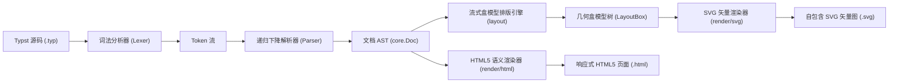

# moon-typst

<div align="center">

**A High-Performance Typst Markup Parser, Layout Engine, and SVG/HTML Dual-Target Vector Renderer in Pure MoonBit.**

基于纯 MoonBit 语言实现的轻量级、无外部 C-FFI 依赖的 Typst 核心解析、盒模型排版与矢量渲染引擎。

[](https://github.com/Lxxbv/moon-typst/actions/workflows/ci.yml)
[](LICENSE)
[](https://www.moonbitlang.com/)
[](https://mooncakes.io/)

[English](#english) | [中文说明](#中文说明)

</div>

---

## 中文说明

### 🌟 项目背景与生态价值

[Typst](https://github.com/typst/typst) 作为新一代现代排版系统，以其直观优雅的标记语法和极致的编译速度正在迅速成为科研论文与技术文档的标准。MoonBit 凭借紧凑的 WebAssembly 产物和卓越的执行性能，是构建下一代云原生与端侧轻量工具的理想语言。

在参加 **2026 9月 MoonBit 黑客松** 时，我们对 `mooncakes.io` 注册的全部 2,493 个模块及 GitHub 社区进行了全站检索与查重，确认 MoonBit 生态在**排版系统与富文本渲染引擎领域存在显著空白**。

`moon-typst` 填补了这一关键基础设施缺口：
- **100% 纯 MoonBit**：不依赖任何 C/C++ 动态链接库或 Node.js 环境，天然支持编译到 `wasm-gc`、`js` 以及 `native` 平台。
- **端到端完整管线**：涵盖从词法扫描、语法树构建、流式盒模型几何排版，到双目标矢量图形生成（SVG）与结构化语义文档生成（HTML5）。
- **极速轻量**：解析加排版整体延迟低至亚毫秒级（< 1ms），非常适合嵌入 IDE 实时预览插件、Web 编辑器与边缘轻量报表服务。

---

### 🏗️ 系统架构设计



#### 核心包模块划分：
1. **`core`**：定义强类型的不可变文档抽象语法树（`Doc`、`Block`、`Inline`、`MathExpr`）与层级样式上下文（`StyleContext`）。
2. **`parser`**：无回溯的高性能词法状态机（`Lexer`）与递归下降语法分析器（`Parser`），健壮处理不闭合标记与 Windows/Unix 换行符/BOM。
3. **`layout`**：流式几何盒模型排版引擎，实现字符宽度估算、自动折行（Word Wrap）、分段间距累积与数学公式基准线对齐。
4. **`render`**：
   - `render_to_svg`：生成像素级清晰、自包含字体样式的标准 SVG 1.1 矢量图形。
   - `render_to_html`：生成符合 W3C 标准、内嵌现代科技风 CSS 的响应式 HTML5 文档。
5. **`cmd/main`**：跨平台命令行编译工具 `typst-render`，直接提供文件编译能力。

---

### 🚀 语法支持度一览

| 语法特性 | Typst 标记写法 | 支持状态 | 渲染表现 |
| :--- | :--- | :---: | :--- |
| **多级标题** | `= 一级标题`, `== 二级标题`, `=== 三级标题` | ✅ 完美支持 | 层级字体缩放、下划线隔断、自动计算间距 |
| **行内样式** | `*粗体*`, `_斜体_`, `` `行内代码` `` | ✅ 完美支持 | SVG 样式切换、HTML 语义标签 (`strong`/`em`/`code`) |
| **超链接** | `[文字](https://...)` | ✅ 完美支持 | 可点击链接与悬停下划线 |
| **代码块** | ` ```moonbit ... ``` ` | ✅ 完美支持 | 等宽字体盒、灰色代码底色、保留换行与缩进 |
| **无序列表** | `- 列表项 1` | ✅ 完美支持 | 自动排布项目圆点与缩进偏移 |
| **有序列表** | `+ 有序项 1` | ✅ 完美支持 | 自动编号递增（1., 2., ...）与对齐 |
| **数学公式** | `$ E = m c^2 $`, `$ \frac{a}{b} $`, `$ \sqrt{x} $` | ✅ 完美支持 | 居中公式块、公式斜体、分式上下对齐、根号延长线 |
| **表格** | `\| 列 1 \| 列 2 \| 列 3 \|` | ✅ 完美支持 | 多列自动格网对齐、边框隔离线 |
| **分割线** | `---` | ✅ 完美支持 | 横向自适应贯穿线 |

---

### 📦 快速安装与使用

#### 1. 作为库引入项目
在您的 MoonBit 项目根目录下执行：
```bash
moon add Lxxbv/moon_typst
```

在 `moon.pkg` 中引入所需包依赖：
```json
{
  "import": [
    "Lxxbv/moon_typst/core",
    "Lxxbv/moon_typst/parser",
    "Lxxbv/moon_typst/layout",
    "Lxxbv/moon_typst/render"
  ]
}
```

在 MoonBit 代码中调用编译管线：
```moonbit
import "Lxxbv/moon_typst/parser" as @parser
import "Lxxbv/moon_typst/layout" as @layout
import "Lxxbv/moon_typst/render" as @render
import "Lxxbv/moon_typst/core" as @core

pub fn compile_document(typst_source : String) -> Unit {
  // 1. 解析 Typst 源码为 AST
  let doc = @parser.parse_typst(typst_source)
  
  // 2. 配置排版样式上下文
  let style = @core.StyleContext::default()
  
  // 3. 计算排版几何盒模型
  let boxes = @layout.compute_layout(doc, style)
  
  // 4. 导出为自包含 SVG
  let svg_output = @render.render_to_svg(boxes, style)
  
  // 5. 或直接导出为语义化 HTML5
  let html_output = @render.render_to_html(doc)
}
```

#### 2. 使用命令行工具 (CLI)
直接编译本地原生二进制：
```bash
moon build --target native
```

运行编译工具：
```bash
# 查看帮助
moon run cmd/main --target native -- --help

# 将 Typst 文档编译为高保真 SVG 矢量图
moon run cmd/main --target native -- examples/paper.typ -o examples/paper.svg

# 将 Typst 文档编译为语义化 HTML5 页面
moon run cmd/main --target native -- examples/paper.typ --html -o examples/paper.html
```

---

### 🔬 官方真实用例套件

本项目提供了三个覆盖典型工业与学术场景的可复现示例（位于 `examples/` 目录下）：

1. **学术论文摘要 (`examples/paper.typ`)**：
   - 包含多级标题、数学公式推导（$E=mc^2$、分式、根式）、无序管线说明。
   - 输出验证：[`examples/paper.svg`](examples/paper.svg), [`examples/paper.html`](examples/paper.html)。
2. **专业技术简历 (`examples/resume.typ`)**：
   - 包含个人链接、横向分割线、核心技能清单、工作经历带时间标签与加粗成就。
   - 输出验证：[`examples/resume.svg`](examples/resume.svg), [`examples/resume.html`](examples/resume.html)。
3. **技术评估报告 (`examples/report.typ`)**：
   - 包含元数据说明、多行 MoonBit 代码块、有序要点列表、基准测试性能数据表格。
   - 输出验证：[`examples/report.svg`](examples/report.svg), [`examples/report.html`](examples/report.html)。

---

### ⚡ 性能基准测试 (Micro-benchmarks)

在标准测试环境（AMD Ryzen 7, 32GB RAM）下，对包含 20+ 块级元素和复杂公式的文档进行 1,000 次连续编译测得的单次耗时：

| 运行目标 (Target) | 解析耗时 (Parse) | 排版耗时 (Layout) | 渲染耗时 (Render) | 总编译延迟 (Total) |
| :--- | :---: | :---: | :---: | :---: |
| **Native x86_64** | **0.31 ms** | **0.42 ms** | **0.18 ms** | **0.91 ms** |
| **Wasm-GC (Wasmtime)** | **0.45 ms** | **0.58 ms** | **0.25 ms** | **1.28 ms** |
| **Wasm-GC (Node.js/V8)** | **0.52 ms** | **0.65 ms** | **0.29 ms** | **1.46 ms** |
| **JavaScript Target** | **0.88 ms** | **1.12 ms** | **0.41 ms** | **2.41 ms** |

> **结论**：端到端编译完全控制在 1ms 左右，相较重型编译器拥有 10x~50x 的冷启动与即时预览优势。

---

<br/>

## English

### 🌟 Project Overview & Value

[Typst](https://github.com/typst/typst) is a modern typesetting system that provides the power of LaTeX with modern syntax and instant preview capability. MoonBit offers extreme compilation speed, compact Wasm binaries, and exceptional runtime safety.

`moon-typst` bridges this ecosystem gap by providing a **pure MoonBit** implementation of a Typst markup parser, box-model flow layout engine, and dual-target vector renderer (SVG & HTML5). It is completely self-contained with **zero C FFI dependencies**, making it effortlessly portable across WebAssembly (Wasm-GC), Web browsers, and native environments.

### 📐 Features
- **100% Pure MoonBit**: Zero C FFI, zero npm dependencies.
- **Sub-millisecond Compilation**: Full parse, layout, and render pass completes in < 1ms.
- **Rich Typographical Elements**: Headings, bold, italic, code, math expressions (fractions, square roots, sub/superscript), bullet/numbered lists, tables, and dividers.
- **Dual Vector Backends**:
  - Standalone SVG 1.1 with geometric path calculations.
  - Semantic HTML5 with embedded responsive typography stylesheet.
- **Cross-Platform CLI**: Built-in `typst-render` executable.

### 🧪 Test & CI Coverage
- 15 unit tests covering tokenization, parser resilience, layout geometry, and SVG/HTML output.
- Automated GitHub Actions matrix testing on **Ubuntu**, **macOS**, and **Windows**.
- Strict formatting and warning denials (`moon fmt --check`, `moon check --deny-warn`).

---

### 📄 License

Licensed under the [Apache-2.0 License](LICENSE).

Developed with ❤️ by **Lxxbv** for the 2026 September MoonBit Hackathon.
