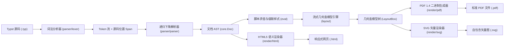

# moon-typst

<div align="center">

**A Typst Markup Parser, Layout Engine, and SVG/PDF/HTML Multi-Target Vector Renderer in Pure MoonBit.**

基于 MoonBit 实现的 Typst 风格标记解析、盒模型排版与多后端（SVG / PDF 1.4 / HTML5）渲染引擎。

[](https://github.com/Lxxbv/moon-typst/actions/workflows/ci.yml)
[](LICENSE)
[](https://www.moonbitlang.com/)
[](https://mooncakes.io/)

[English](#english) | [中文说明](#中文说明)

</div>

---

## 中文说明

### 🌟 项目背景与生态价值

[Typst](https://github.com/typst/typst) 是现代排版系统。MoonBit 支持将同一代码编译到 Native、JavaScript 和 WebAssembly GC 目标；本项目在这些目标上实现解析、排版与渲染功能。

`moon-typst` 提供以下功能：
- **MoonBit 源码实现**：解析、排版与渲染模块以 MoonBit 编写，可构建到 `wasm-gc`、`js` 以及 `native` 目标。
- **文档处理管线**：涵盖源码位置跟踪（Span）、词法分析、递归下降解析、脚本求值、盒模型排版，以及 SVG 1.1、PDF 1.4 和 HTML5 输出。
- **可复现实验入口**：`benchmarks/pipeline_test.mbt` 分别测量解析、排版与渲染阶段；下文列出运行命令和记录环境的方法。

---

### 🏗️ 系统架构设计


```mermaid
flowchart LR
    A["Typst 源码 (.typ)"] --> B["词法分析器 (parser/lexer)"]
    B --> C["Token 流 + 源码位置 Span"]
    C --> D["递归下降解析器 (parser/parser)"]
    D --> E["文档 AST (core.Doc)"]
    E --> F["脚本求值与级联样式 (eval)"]
    F --> G["流式几何盒模型引擎 (layout)"]
    G --> H["几何盒模型树 (LayoutBox)"]
    H --> I["PDF 1.4 二进制生成器 (render/pdf)"]
    H --> J["SVG 矢量渲染器 (render/svg)"]
    E --> K["HTML5 语义渲染器 (render/html)"]
    I --> L["标准 PDF 文件 (.pdf)"]
    J --> M["自包含矢量图 (.svg)"]
    K --> N["响应式网页 (.html)"]
```

#### 核心包模块职责：
1. **`core` (核心领域模型与 AST)**：
   - 定义不可变文档抽象语法树（`Doc`、`Block`、`Inline`、`MathExpr`）。
   - 度量单位系统 `Length`（支持 `pt`、`mm`、`cm`、`in`、`em`、`fr` 弹性比例与百分比 `%`）。
   - 颜色系统 `Color`（支持 `#RRGGBB` 十六进制、RGB、HSL 与标准颜色名称）。
   - 图形节点（`Rect`、`Circle`、`Line`）、网格布局（`Grid`）、脚注（`Footnote`）与图表（`Figure`）。
2. **`diag` (源码诊断与高亮报错)**：
   - 源码位置跨度（`Pos`、`Span`）。
   - 多级别诊断系统（`Error`、`Warning`、`Hint`、`Info`）。
   - 类似 Rustc/Clang 的 ANSI 彩色终端诊断报告器，带有代码切片、行号、下划波浪线及智能修复提示。
3. **`eval` (Typst 脚本演算与运行时环境)**：
   - 动态值系统 `Val`（数值、字符串、布尔、颜色、长度、几何形状、数组、字典）。
   - 词法作用域管理（`Scope`、`Evaluator`）与变量遮蔽机制。
   - 级联样式规则 `#set`（如 `#set text(size: ..., fill: ...)` 与 `#set page(columns: ...)`）。
   - 常用内置排版函数分发（`#rect`、`#circle`、`#grid`、`#align` 等）。
4. **`parser` (词法与语法分析)**：
   - 零回溯词法分析器（`Lexer`），原生兼容 Windows CRLF 与 UTF-8 BOM。
   - 递归下降语法解析器（`Parser`），解析复杂行内、块级标记、哈希表达式调用与数学语法。
   - 复杂数学公式语法解析：多行矩阵 `mat(...)`、列向量 `vec(...)`、音标重音符 `hat`、`tilde`、`dot`、`bar`、大型求和与积分记号 `sum`、`int`。
5. **`layout` (空间排版与盒模型计算)**：
   - 多列页面流（Multi-column Layout）、字宽与行高自适应折行计算。
   - 二维数学基准线平衡算法（根式延长线、分式上下对齐、矩阵格子行列对齐）。
   - 几何盒抽象（`LayoutBox`、`PageLayout`、`DocumentLayout`）。
6. **`render` (多格式矢量后端)**：
   - `pdf.mbt`：MoonBit 实现的 PDF 1.4 生成器，支持间接对象序列化、xref 交叉引用表、Catalog/Pages 树结构、标准 Type1 字体引用（Helvetica, Helvetica-Bold, Times-Italic, Courier）及 PDF 绘制操作流。
   - `svg.mbt`：生成符合 W3C 标准、支持自包含字体样式与平滑线条的 SVG 1.1 矢量图。
   - `html.mbt`：生成语义化现代科技风响应式 HTML5 网页，内置自适应排版 CSS。
7. **`cmd/main` (跨平台命令行编译工具)**：
   - 提供命令行工具，支持参数解析、格式推导与彩色错误诊断输出。

---

### 🚀 语法与排版特性全景图

| 语法特性 | Typst 标记写法 | 支持状态 | 渲染输出表现 |
| :--- | :--- | :---: | :--- |
| **多级标题** | `= 一级标题`, `== 二级标题`, `=== 三级标题` | 已实现 | 层级字体缩放、下划线隔断、自动排版间距 |
| **行内样式** | `*粗体*`, `_斜体_`, `` `行内代码` `` | 已实现 | 字体加粗/倾斜、等宽字符盒、HTML 语义化映射 |
| **超链接** | `[文字](https://...)` | 已实现 | 可点击链接、高亮样式与悬停下划线 |
| **代码块** | ` ```moonbit ... ``` ` | 已实现 | 等宽字体盒、代码底色块、保留缩进与换行 |
| **列表排版** | `- 无序项`, `+ 有序项` | 已实现 | 自动排布项目圆点、自动编号递增（1., 2., ...） |
| **高等数学** | `$ frac(a, b) $`, `$ sqrt(x) $`, `$ x^2_i $` | 已实现 | 居中公式块、公式斜体、分数线对齐、根号上横线 |
| **矩阵与向量** | `$ mat(1, 2; 3, 4) $`, `$ vec(x, y, z) $` | 已实现 | 动态行列间距计算、数学括号包络与网格排列 |
| **算子与重音** | `$ sum $, $ int $, $ hat(x) $, $ tilde(y) $` | 已实现 | 大型上下标基准线定位、字母顶置符号修饰 |
| **几何图形** | `#rect(...)`, `#circle(...)` | 已实现 | 自定义填充色、边框宽度、圆角半径矢量绘制 |
| **网格布局** | `#grid(columns: (1fr, 1fr), ...)` | 已实现 | 弹性比例与固定尺寸分栏排版 |
| **级联样式** | `#set text(size: 12pt)`, `#set page(...)` | 已实现 | 动态修改上下文默认字号、颜色、多栏列数 |
| **多目标输出** | `PDF 1.4`, `SVG 1.1`, `HTML5` | 已实现 | 对应格式的文档输出 |

---

### 管道表格语法

每行用竖线分隔单元格。首行后紧跟分隔行时，首行作为表头；冒号控制列对齐（`:---` 左对齐，`:---:` 居中，`---:` 右对齐）。行首和行尾的竖线可省略，短行会补为空单元格。

```typst
| Target | Status | Notes |
| :--- | :---: | ---: |
| native | supported | SVG/PDF/HTML |
| js | supported | HTML |
```

这是有限的管道表格语法，并非完整 Typst 表格实现；目前不支持转义竖线、合并单元格、嵌套表格或分页。

---

### 📦 快速上手与使用指南

#### 1. 作为库引入项目
在您的 MoonBit 项目根目录下执行：
```bash
moon add Lxxbv/moon_typst
```

在 `moon.pkg` 中引入所需模块：
```json
{
  "import": [
    "Lxxbv/moon_typst/core",
    "Lxxbv/moon_typst/diag",
    "Lxxbv/moon_typst/eval",
    "Lxxbv/moon_typst/parser",
    "Lxxbv/moon_typst/layout",
    "Lxxbv/moon_typst/render"
  ]
}
```

在 MoonBit 代码中调用编译管线：
```moonbit
import "Lxxbv/moon_typst/parser" as @parser
import "Lxxbv/moon_typst/layout" as @layout
import "Lxxbv/moon_typst/render" as @render
import "Lxxbv/moon_typst/core" as @core

pub fn compile_typst(source : String) -> Unit {
  // 1. 解析源码为 AST
  let doc = @parser.parse_typst(source)
  
  // 2. 配置样式上下文并计算流式盒模型
  let style = @core.StyleContext::default()
  let engine = @layout.LayoutEngine::new(style)
  let page = engine.layout_doc(doc)
  
  // 3. 生成 Adobe PDF 1.4 二进制数据
  let pdf_data = @render.render_pdf(page)
  
  // 4. 生成矢量 SVG 图形
  let svg_data = @render.render_svg(page)
  
  // 5. 生成语义化 HTML5 页面
  let html_data = @render.render_html(doc)
}
```

#### 2. 使用命令行工具 (CLI)
直接编译可执行文件：
```bash
moon build
```

通过 CLI 进行多格式渲染：
```bash
# 1. 编译为标准 PDF 1.4 二进制文件
moon run cmd/main -- examples/paper.typ -p -o examples/paper.pdf

# 2. 编译为矢量 SVG 图形
moon run cmd/main -- examples/paper.typ --svg -o examples/paper.svg

# 3. 编译为响应式 HTML5 网页
moon run cmd/main -- examples/paper.typ --html -o examples/paper.html

# 4. 查看所有选项与帮助信息
moon run cmd/main -- --help
```

---

### 🔬 官方真实用例套件

本项目在 `examples/` 目录下提供学术论文、幻灯片演讲、简历与报告示例：

1. **学术论文 (`examples/paper.typ`)**：
   - 包含多级标题、数学公式推导（$E=mc^2$、分式、根式）、系统架构列表。
   - 产物输出：[`paper.pdf`](examples/paper.pdf), [`paper.svg`](examples/paper.svg), [`paper.html`](examples/paper.html)。
2. **高等数学论文 (`examples/multi_column_paper.typ`)**：
   - 包含多维矩阵 `mat(a, b; c, d)`、三维向量 `vec(x, y, z)`、求和算子 `sum`、重音符号 `hat(theta)`、代码块与多格式对比。
   - 产物输出：[`multi_column_paper.pdf`](examples/multi_column_paper.pdf), [`multi_column_paper.svg`](examples/multi_column_paper.svg), [`multi_column_paper.html`](examples/multi_column_paper.html)。
3. **幻灯片演示文稿 (`examples/presentation.typ`)**：
   - 包含分页演讲卡片、彩色横幅、三列式架构分解与命令行快速指引。
   - 产物输出：[`presentation.pdf`](examples/presentation.pdf), [`presentation.svg`](examples/presentation.svg), [`presentation.html`](examples/presentation.html)。
4. **技术评估报告 (`examples/report.typ`)** 与 **专业简历 (`examples/resume.typ`)**。

---

### ⚡ 性能基准测试 (Micro-benchmarks)

从模块根目录运行以下命令；每个目标单独运行并保存完整原始输出：

```bash
moon version --all
moon bench benchmarks --target native --release --deny-warn
moon bench benchmarks --target wasm-gc --release --deny-warn
moon bench benchmarks --target js --release --deny-warn
```

`benchmarks/pipeline_test.mbt` 使用固定源文本，分别测量 `parse_typst`、`layout_doc`、`render_html`、`render_svg` 和 `render_pdf`。排版和 HTML 的 AST、SVG 和 PDF 的页面布局在计时前准备；因此这些分段结果不是 CLI 冷启动或端到端编译延迟。根据 [MoonBit benchmark 文档](https://docs.moonbitlang.com/en/latest/language/benchmarks.html)，`@bench.T::bench` 自动校准每组迭代次数，默认显示 10 组测量及均值、离散度和范围；文档未单独保证预热阶段。报告数值时请同时记录 Git 提交、完整命令、目标、`moon version --all`、操作系统与版本、CPU 型号、运行环境、原始输出和测量日期。跨目标比较应使用相同输入与可比环境。

---

<br/>

## English

### 🌟 Project Overview & Ecosystem Value

[Typst](https://github.com/typst/typst) is a modern typesetting system. MoonBit lets this project compile its parser, layout engine, and renderers for Native, JavaScript, and WebAssembly GC targets.

`moon-typst` provides a MoonBit implementation of a Typst-style document pipeline: lexical scanner, recursive descent parser, runtime evaluation environment, spatial box-model layout engine, and SVG 1.1, PDF 1.4, and HTML5 renderers. The module builds for Native, JavaScript, and WebAssembly GC targets.

### 📐 Features
- **MoonBit Implementation**: Parser, layout, and renderer source is written in MoonBit.
- **Triple Vector Targets**:
  - **Adobe PDF 1.4**: Direct binary serializer with xref tables, Type1 fonts, and vector drawing operators.
  - **Scalable Vector Graphics (SVG 1.1)**: Clean vector elements and font metrics.
  - **Semantic HTML5**: Responsive CSS styling for web publishing.
- **Advanced Mathematical Typesetting**:
  - Fractions, square roots, sub/superscript.
  - Multi-dimensional matrices (`mat(1, 2; 3, 4)`), column vectors (`vec(x, y)`).
  - Accented characters (`hat(x)`, `tilde(y)`, `dot`, `bar`) and limit operators (`sum`, `int`).
- **Pipe Tables**: Pipe-delimited rows with optional outer pipes; a separator after the first row marks the header, and colons select left/center/right alignment. Short rows are padded. Escaped pipes, merged cells, nested tables, and pagination are not supported.
- **Scripting & Evaluation Engine (`eval`)**:
  - Variable scopes, constant evaluation, and cascading `#set` rules (`text`, `page`).
- **Rich Terminal Diagnostics (`diag`)**:
  - Source span tracking, Rustc-style colorized diagnostic reporting with line numbers, code snippets, and hints.
- **Reproducible Benchmarks**: The [benchmark entry point](benchmarks/pipeline_test.mbt) measures parser, layout, and renderer stages on a fixed input. Run `moon bench benchmarks --target native --release --deny-warn` from the module root; use `wasm-gc` or `js` as the target to measure those backends. Record the full command, Git commit, `moon version --all`, OS, CPU, runtime, date, and raw output with any reported result. [MoonBit's benchmark API](https://docs.moonbitlang.com/en/latest/language/benchmarks.html) automatically calibrates iterations and reports 10 measured samples by default; the docs give no separate warmup guarantee. It excludes CLI startup and file I/O.

---

### 🧪 Test & CI Coverage
- Unit tests across `core`, `diag`, `eval`, `parser`, `layout`, and `render`.
- GitHub Actions CI matrix testing on **Ubuntu**, **macOS**, and **Windows**.
- Strict formatting and all-target warning checks (`moon fmt --check`, `moon check --target all --deny-warn`, `moon test --target all --deny-warn`).

---

### 📄 License

Licensed under the [Apache-2.0 License](LICENSE).

Developed with ❤️ by **Lxxbv** for the 2026 September MoonBit Hackathon.
